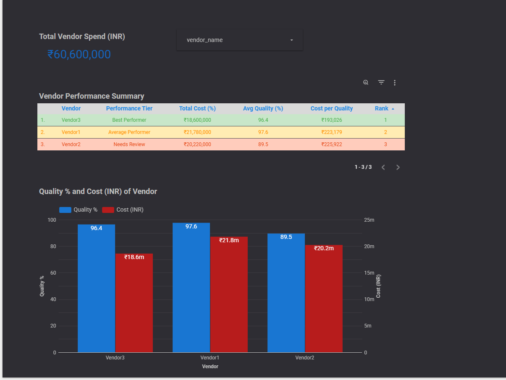

# 📊 Vendor Performance Analysis – Cost vs Quality (2025)

## 📌 Project Overview

This project analyzes vendor performance by comparing **cost vs quality metrics** to identify the most cost-effective vendors.

The objective is to simulate a real-world vendor evaluation scenario where business decisions are driven by:

* Cost efficiency
* Quality performance
* Audit results
* Data-backed ranking

The project demonstrates an **end-to-end analytics workflow**, starting from data creation to visualization and storytelling.

---

## 🎯 Business Objective

The goal of this analysis is to answer:

* Which vendor provides the best value for money?
* How does quality vary across vendors?
* Are higher costs always associated with better quality?
* Which vendors require performance review?

This type of analysis is commonly used in:

* Vendor management
* Operations analytics
* Procurement decision-making
* Quality assurance reporting

---

## 🛠 Tools & Technologies Used

* **SQL Server** – Data creation and preprocessing
* **Google BigQuery** – Data storage and analytical querying
* **Looker Studio** – Data visualization and dashboarding
* **GitHub** – Version control and documentation

---

## 🧱 Project Workflow

### 1️⃣ Data Creation (SQL Server)

* Created two datasets:

  * **Vendor Payment Data**
  * **Vendor Quality Data**
* The data was exported as CSV files.
* CSV files were uploaded into Google BigQuery for analysis.

* Data includes:

  * Vendor name
  * Monthly activity
  * Titles processed
  * Cost per title
  * Audit results (defects & quality)

* SQL scripts were used to:

  * Create tables
  * Insert monthly data
  * Maintain data consistency

---

### 2️⃣ Data Export & BigQuery Integration

* Data exported from SQL Server as CSV files
* Uploaded into **Google BigQuery**
* Tables recreated in BigQuery
* Analytical view created using SQL

The analytical view calculates:

* Total yearly cost
* Average quality percentage
* Audit coverage
* Cost per quality point
* Vendor ranking

---

### 3️⃣ Data Analysis (BigQuery SQL)

The analysis includes:

* Aggregation of vendor costs
* Quality percentage calculation
* Cost-per-quality metric
* Vendor ranking using window functions
* Performance classification

#### Key SQL Concepts Used:

* Common Table Expressions (CTEs)
* Aggregations (`SUM`, `AVG`)
* Window functions (`DENSE_RANK`)
* Calculated fields
* Data normalization

---

## 📊 Dashboard Visualization

Below is a snapshot of the final dashboard created using **Looker Studio**.

Click the image to view it in full size:


---

## 🔗 Interactive Dashboard

View the live interactive dashboard here:

👉 **https://lookerstudio.google.com/u/0/reporting/9fc89984-b2ca-44bb-bbdf-d681005bc567/page/T9zlF**

---
## 📌 How to Use This Dashboard
- Use the **vendor filter** to analyze individual vendor performance.
- Compare **cost vs quality metrics** across vendors.
- Review the **performance tier** to identify top and underperforming vendors.
- Use the **cost per quality metric** to assess vendor efficiency.
- The dashboard is interactive and updates dynamically based on selections.

## 📈 Dashboard Highlights

### 🔹 Key Metrics Displayed

* Total Vendor Cost (INR)
* Average Quality Percentage
* Cost per Quality Point
* Vendor Ranking

### 🔹 Visual Features

* Conditional formatting for performance tiers
* Interactive vendor filtering
* Cost vs Quality comparison
* Executive-friendly layout

---

## 🔍 Key Findings & Insights

- **Vendor 3 emerged as the best-performing vendor**, delivering strong quality at a comparatively lower cost, making it the most cost-efficient option.
- **Vendor 1 ranked second**, achieving high quality scores but at a significantly higher cost, which reduced overall efficiency.
- **Vendor 2 performed the weakest**, showing the lowest quality score and the highest cost per quality point.
- This analysis confirms that **higher spending does not necessarily lead to better quality**.
- The **cost-per-quality metric** proved to be the most reliable indicator for evaluating vendor performance.
- Vendor ranking clearly highlighted:
  - High-performing vendors  
  - Cost-heavy but quality-driven vendors  
  - Vendors requiring performance improvement  


---

## 📂 Project Structure

```
vendor-performance-analysis/
│
├── sql/
│   ├── vendor_payment_setup.sql
│   ├── vendor_quality_setup.sql
│   └── vendor_performance_view.sql
│
├── screenshots/
│   └── dashboard.png
│
├── data/
│   └── csv_files/
│
└── README.md
```

---

## ✅ Conclusion

This project demonstrates how SQL and BI tools can be used together to:

* Transform raw operational data
* Perform structured analysis
* Build decision-ready dashboards
* Communicate insights effectively

It reflects a real-world analytics workflow commonly used in operations, finance, and vendor management teams.

---

## 🚀 Next Steps

* Add historical trend analysis
* Include SLA-based scoring
* Automate refresh using scheduled queries
* Extend dashboard with cost forecasting


